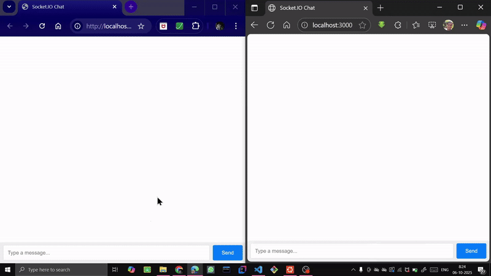

# Report: Socket.IO Chat

This report covers the core aspects of the real-time application built using Node.js, Express and Socket.IO.


## Objective
The main aim was to create a simple webpage where multiple people can talk to each other without needing to refresh the page.


## Main Project Components
- **The Server (index.js):** It constantly waits for users to connect, followed by managing the real-time flow of all chat messages between them.
- **The Client (index.html):** The client refers to the webpage that the users interact with, responsible for updating the chat and displaying all the messages on the screen.


## Communication Flow
- When the user types a message into the textbox and hits 'send', the browser forwards the information to the central server.
- The server then relays a copy of that message to every other user connected to the chat.
- Each user's browser receives the message from the server and instantly updates the chat list to display it for everyone at the same time.


## Technology Stack
- **Node.js:** A JavaScript runtime environment that executes the server-side code, working as the backend
- **Express:** A framework for Node.js that serves the frontend webpage
- **Socket.IO:** The library that creates a two-way connection between the server and each user, enabling instant message delivery

## Chat App in Action


## Installation and Setup Guide

### **1. Prerequisites (One-Time Setup)**

Before beginning, it has to be ensured that the following are installed:
- **Node.js and npm:** [Node.js official website](https://nodejs.org/) (download the "LTS" version)
- **Git:** [Git official website](https://git-scm.com/)
- **A Code Editor:** [Visual Studio Code](https://code.visualstudio.com/) (recommended)

### **2. Installation Steps**

- **Clone the Repository:**
    Open a terminal (like PowerShell, Command Prompt or Ubuntu in WSL) and run the following command to download the project files from GitHub:
    ```bash
    git clone https://github.com/SilverSquare-22/Chat-App
    ```
- **Navigate to the Project Folder:**
    Once the download is complete, move into the project's directory.
    ```bash
    cd Socket-IO-Chat
    ```
- **Install Project Dependencies:**
    This command reads the `package.json` file and automatically downloads all the necessary code toolboxes (like Express and Socket.IO) that the project needs to function.
    ```bash
    npm install
    ```


### **3. Running the Application**

- **Start the Server:**
    While still inside the project folder in your terminal, run the following command:
    ```bash
    node index.js
    ```
- **Check the Output:**
    The terminal should display a confirmation message:
    `Server is listening on http://localhost:3000`


### **4. Viewing the App in Browser**

- Open any web browser (like Chrome, Firefox, or Edge).
- Go to the following address:
    **`http://localhost:3000`**
- Alternatively, you can also follow the link by clicking on it in the terminal.

To test the chat, open a second browser tab or window and navigate to the same address.
